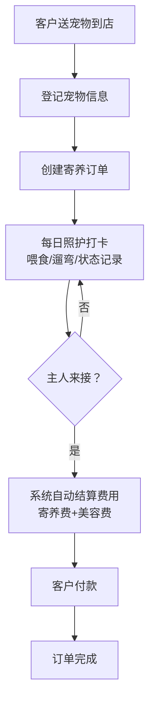
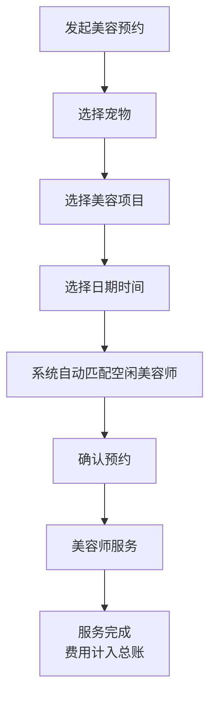

## 1. 产品概述

本产品是一款面向小型宠物店的宠物寄养与美容预约管理工具，帮助店主高效管理宠物寄养、美容服务、日常照护记录及财务统计。
- 解决宠物店手工记录混乱、信息查找困难、费用计算易出错等痛点
- 提升宠物店日常运营效率，规范服务流程，提供数据化经营决策支持

## 2. 核心功能

### 2.1 用户角色
| 角色 | 注册方式 | 核心权限 |
|------|---------|---------|
| 店主/店员 | 默认登录 | 全部功能：寄养管理、美容预约、日常记录、结账、统计 |

### 2.2 功能模块
1. **仪表盘首页**：今日寄养宠物概览、今日美容预约、待办事项提醒、快捷操作入口
2. **寄养管理**：新增寄养登记、寄养宠物列表、寄养详情查看、寄养状态管理
3. **美容预约**：新增美容预约、美容师排班、预约列表、预约状态管理
4. **日常照护**：每日喂食/遛弯打卡、宠物状态记录、历史照护日志
5. **结账管理**：自动计算费用（寄养费+美容费）、付款记录、订单完成
6. **数据统计**：月度寄养品种排行、美容项目热度统计、收入概览

### 2.3 页面详情
| 页面名称 | 模块名称 | 功能描述 |
|---------|---------|---------|
| 仪表盘首页 | 数据概览卡片 | 显示在寄养宠物数量、今日预约数、待结账数、本月收入 |
| 仪表盘首页 | 今日寄养列表 | 展示当前在店寄养宠物，支持快捷打卡 |
| 仪表盘首页 | 今日美容预约 | 展示当天美容预约时间表 |
| 仪表盘首页 | 快捷操作 | 新增寄养、新增美容预约、快速结账入口 |
| 寄养管理 | 寄养登记表单 | 录入宠物名、品种、主人电话、寄养天数、喂食要求、特殊需求、每日寄养费 |
| 寄养管理 | 寄养列表 | 按状态筛选（在店/已完成），支持搜索和查看详情 |
| 寄养管理 | 寄养详情页 | 展示宠物完整信息、照护记录时间线、关联美容预约、费用明细 |
| 美容预约 | 预约表单 | 选择寄养宠物、美容项目、日期时间，自动显示空闲美容师 |
| 美容预约 | 预约日历/列表 | 按日期查看预约安排，管理预约状态（待服务/进行中/已完成） |
| 美容预约 | 美容师管理 | 美容师列表及服务项目配置 |
| 日常照护 | 打卡面板 | 早晚喂食打卡、遛弯打卡按钮，记录时间 |
| 日常照护 | 状态记录 | 选择或输入宠物状态（精神好、食欲正常、拉肚子等） |
| 日常照护 | 照护日志 | 按日期查看历史照护记录时间线 |
| 结账管理 | 费用结算 | 自动计算寄养费（天数×日单价）+美容费总和，支持优惠调整 |
| 结账管理 | 结账列表 | 未结账/已结账订单，支持查看详情和导出 |
| 数据统计 | 寄养品种统计 | 柱状图展示各品种寄养次数/天数排行 |
| 数据统计 | 美容项目统计 | 饼图/柱状图展示各美容项目预约热度 |
| 数据统计 | 收入统计 | 月度收入趋势图，寄养/美容收入占比 |

## 3. 核心流程

### 3.1 宠物寄养流程
客户送宠物到店 → 店主登记宠物信息（名称、品种、主人电话、寄养天数、喂食要求、特殊需求）→ 系统创建寄养订单（状态：在店）→ 每日进行喂食/遛弯打卡和状态记录 → 宠物可同时预约美容服务 → 主人来接宠物 → 系统自动计算总费用 → 完成付款 → 订单状态变更为"已完成"

### 3.2 美容预约流程
选择寄养宠物或散客 → 选择美容项目 → 选择日期时间 → 系统自动显示该时段空闲美容师 → 确认预约 → 美容师服务 → 服务完成 → 费用计入寄养订单总账

## 4. 用户界面设计

### 4.1 设计风格
- **主色调**：温暖的奶咖色 #C89F7B 作为主色，搭配柔和的薄荷绿 #8FCFAD 作为辅助色，传递关爱宠物的温馨感
- **中性色**：米白 #FAF7F2 背景，暖灰 #6B5B4F 文字
- **按钮风格**：圆角矩形，柔和阴影，hover时有轻微上浮效果
- **字体**：使用圆润友好的字体，标题用 "Nunito" 或 "Quicksand"，正文字号 14-16px
- **布局风格**：卡片式布局，左侧导航栏 + 顶部面包屑 + 主内容区
- **图标风格**：使用 Lucide 图标库，线条圆角 1.5px，配合宠物相关 emoji 🐶🐱🐾✨

### 4.2 页面设计概述
| 页面名称 | 模块名称 | UI元素 |
|---------|---------|-------|
| 仪表盘首页 | 数据概览卡片 | 渐变背景卡片，大号数字+小字标签，彩色统计图标，入场动画 |
| 仪表盘首页 | 今日寄养卡片 | 宠物头像占位+名字+品种，状态标签（绿色"在店"），打卡按钮组 |
| 仪表盘首页 | 预约时间线 | 垂直时间线布局，显示时段、宠物名、美容师、状态 |
| 寄养管理 | 登记表单 | 双列表单布局，必填项红星标注，输入框有焦点动画，底部大按钮 |
| 寄养管理 | 宠物列表 | 表格布局，支持斑马纹，行hover高亮，操作列图标按钮 |
| 寄养详情 | 信息面板 | 左右分栏，左侧宠物基本信息卡片，右侧照护时间线 |
| 美容预约 | 预约日历 | 周视图日历，色块区分已预约/空闲，点击可创建预约 |
| 日常照护 | 打卡面板 | 大按钮组，打卡成功后绿色勾选动画，记录时间戳 |
| 数据统计 | 图表区域 | 响应式图表，柱状图配渐变填充，数据标签清晰 |

### 4.3 响应式设计
- Desktop-first 设计，主内容区最小宽度 1024px
- 平板设备（768px）：左侧导航收起为图标模式
- 移动端（480px）：底部Tab导航，卡片堆叠排列，表单单列布局

## 5. 数据与业务规则
- 寄养费用 = 实际寄养天数 × 每日寄养单价
- 美容费用按所选项目单价累加
- 寄养天数按自然日计算（入住当天算起，接走当天也算1天或按小时折算，可配置）
- 美容师同一时段只能服务一个预约
- 每日照护记录至少包含早、晚两次喂食打卡
- 特殊需求字段支持多行文本，会在寄养详情和每日打卡页面突出显示
