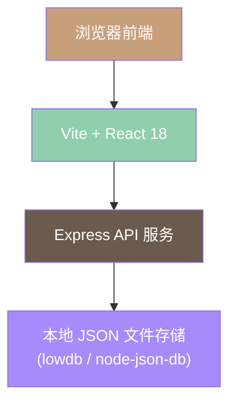
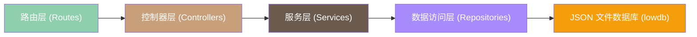
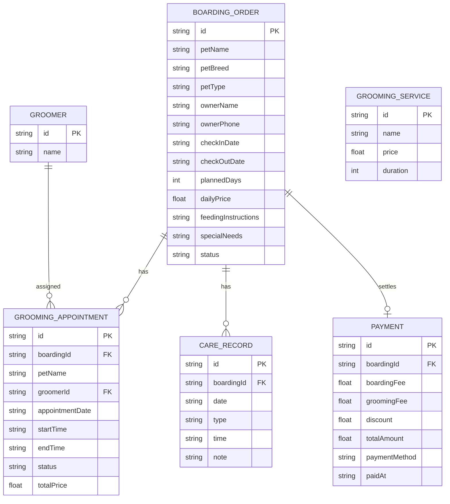

## 1. 架构设计



## 2. 技术描述

- **前端框架**：React 18 + TypeScript + Vite
- **样式方案**：Tailwind CSS 3
- **状态管理**：Zustand（轻量状态管理）
- **路由管理**：React Router DOM 6
- **UI组件**：Lucide React（图标库）+ 自定义组件
- **图表库**：Recharts（数据可视化）
- **后端框架**：Express 4 + TypeScript
- **数据存储**：本地 JSON 文件（使用 lowdb 简化持久化），内置 mock 初始数据
- **HTTP 客户端**：Fetch API（原生）
- **初始化工具**：vite-init（react-express-ts 模板）

## 3. 路由定义

| 路由路径 | 页面名称 | 页面用途 |
|---------|---------|---------|
| / | 仪表盘首页 | 数据概览、今日寄养、今日预约、快捷操作 |
| /boarding | 寄养管理列表 | 在店/已完成寄养宠物列表，搜索筛选 |
| /boarding/new | 新增寄养登记 | 录入宠物寄养信息表单 |
| /boarding/:id | 寄养详情 | 宠物信息、照护记录、费用明细、结账入口 |
| /grooming | 美容预约列表 | 预约日历/列表视图，按日期查看 |
| /grooming/new | 新增美容预约 | 选择宠物、项目、时间、美容师 |
| /groomers | 美容师管理 | 美容师列表、服务项目配置 |
| /care | 日常照护中心 | 喂食/遛弯打卡、状态记录面板 |
| /checkout | 结账管理 | 待结账/已结账订单列表 |
| /checkout/:id | 结账详情 | 费用明细、付款操作 |
| /statistics | 数据统计 | 寄养品种、美容项目、收入统计图表 |

## 4. API 定义

### 4.1 通用响应格式
```typescript
interface ApiResponse<T> {
  success: boolean;
  data?: T;
  error?: string;
}
```

### 4.2 寄养管理 API
```typescript
// 寄养订单类型
interface BoardingOrder {
  id: string;
  petName: string;
  petBreed: string;
  petType: 'dog' | 'cat' | 'other';
  ownerName: string;
  ownerPhone: string;
  checkInDate: string;
  checkOutDate?: string;
  plannedDays: number;
  dailyPrice: number;
  feedingInstructions: string;
  specialNeeds: string;
  status: 'active' | 'completed';
  createdAt: string;
}

// 接口列表
GET    /api/boarding          // 获取寄养列表（支持 ?status=active 查询）
GET    /api/boarding/:id      // 获取单个寄养详情
POST   /api/boarding          // 创建寄养订单
PUT    /api/boarding/:id      // 更新寄养信息
DELETE /api/boarding/:id      // 删除寄养订单
```

### 4.3 美容师与美容服务 API
```typescript
interface Groomer {
  id: string;
  name: string;
  services: string[]; // 服务项目ID列表
  avatar?: string;
}

interface GroomingService {
  id: string;
  name: string;
  price: number;
  duration: number; // 分钟
}

interface GroomingAppointment {
  id: string;
  boardingId?: string; // 关联寄养订单
  petName: string;
  petBreed: string;
  serviceIds: string[];
  groomerId: string;
  appointmentDate: string;
  startTime: string;
  endTime: string;
  status: 'pending' | 'in_progress' | 'completed' | 'cancelled';
  totalPrice: number;
  notes?: string;
}

// 接口列表
GET    /api/groomers               // 获取美容师列表
GET    /api/grooming/services      // 获取美容项目列表
GET    /api/grooming/appointments  // 获取预约列表（支持 ?date=YYYY-MM-DD）
GET    /api/grooming/appointments/:id
POST   /api/grooming/appointments  // 创建预约
PUT    /api/grooming/appointments/:id
DELETE /api/grooming/appointments/:id
GET    /api/grooming/available?date=...&start=...&duration=...  // 查询空闲美容师
```

### 4.4 日常照护 API
```typescript
interface CareRecord {
  id: string;
  boardingId: string;
  date: string;
  type: 'feeding_morning' | 'feeding_evening' | 'walk' | 'status_note';
  time: string;
  note?: string;
  operator?: string;
}

// 接口列表
GET    /api/care?boardingId=xxx    // 获取某宠物照护记录
POST   /api/care                    // 新增照护记录
DELETE /api/care/:id                // 删除照护记录
```

### 4.5 结账与支付 API
```typescript
interface Payment {
  id: string;
  boardingId: string;
  boardingFee: number;      // 寄养费
  groomingFee: number;      // 美容费
  discount: number;         // 优惠金额
  totalAmount: number;      // 实付金额
  paymentMethod: 'cash' | 'wechat' | 'alipay' | 'card';
  paidAt: string;
  remarks?: string;
}

// 接口列表
GET    /api/checkout/pending          // 获取待结账列表
GET    /api/checkout/completed        // 获取已结账列表
GET    /api/checkout/calculate/:id    // 计算寄养订单费用明细
POST   /api/checkout/pay              // 执行结账付款
```

### 4.6 统计 API
```typescript
interface Statistics {
  boardingByBreed: Array<{ breed: string; count: number; days: number }>;
  groomingByService: Array<{ serviceName: string; count: number }>;
  revenue: {
    total: number;
    boardingTotal: number;
    groomingTotal: number;
    monthly: Array<{ month: string; amount: number }>;
  };
}

GET /api/statistics?month=YYYY-MM  // 获取月度统计数据
```

## 5. 服务端架构图



目录结构：
```
api/
├── index.ts              # Express 应用入口
├── routes/               # 路由定义
│   ├── boarding.ts
│   ├── grooming.ts
│   ├── care.ts
│   ├── checkout.ts
│   └── statistics.ts
├── controllers/          # 业务逻辑控制器
├── services/             # 服务层（费用计算、排班等）
├── repositories/         # 数据访问封装
├── db/                   # 数据库初始化 & mock 数据
└── types/                # 共享类型定义
```

## 6. 数据模型

### 6.1 ER 图


### 6.2 数据库初始化（Mock 数据）
- 预置 3 名美容师数据（小美、阿杰、Lisa）
- 预置 6 个美容服务项目（基础洗澡、精致洗护、美容造型、SPA护理、局部修剪、药浴）
- 预置 3-5 条示例寄养订单
- 预置若干照护记录和示例预约
- 所有数据存储于 `api/db/data.json`
